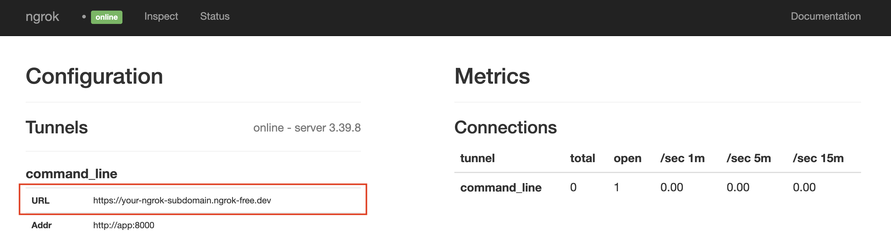
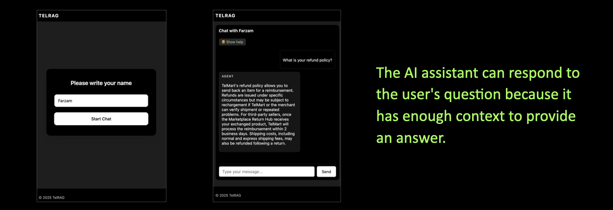
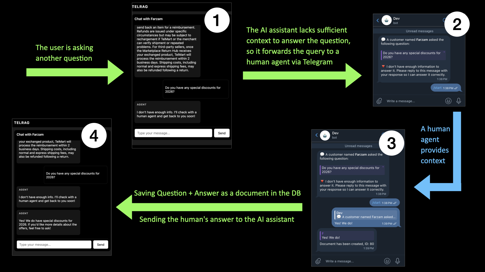

# TelRag

Using Telegram as a content creation source for a RAG system and as an alert system for human agents, created by [Farzam Arefi](https://www.linkedin.com/in/farzamarefi/)

- A light demo version is available at [TelRag.site](http://telrag.site)


Now, your Telegram can serve as a handy and easy tool for quickly filling your knowledge database by simply sending a message or recording your voice!

Also, your Telegram account can function as an alert tool to call a human agent whenever needed. The human agent provides context for the AI assistant, which then uses that context to respond to users!

## Features
- Filling out the RAG system knowledge base is as simple as sending a text message or voice note to your Telegram bot.
- Sending requests that the AI assistant cannot answer to a human agent, right in the middle of a conversation between the user and the AI assistant.
- Using Django as the backend system for a powerful RAG system.
- Using Django Channels, and Daphne to handle WebSocket connections.
- Using HTMX to Handle Requests in the Frontend
- ORM-based native RAG system designed for Django.
- Mathematical Evaluations for RAG Systems Without Using Libraries

## Commands

> Important: This project contains two Docker Compose files. `compose.dev.yaml` (which includes an optional `ngrok` service profile) is used for development, while `docker-compose.yaml` is the production version. All `make` commands are conditional and depend on how the `DEBUG` and `PUBLISH` variables are defined.

- `DEBUG=0`: the production version will be run.
- `DEBUG=1` and `PUBLIC=0`: the development version will be run, without starting the `ngrok` service
- `DEBUG=1` and `PUBLIC=1`: the development version will be run, +with starting the `ngrok` service.

⚠️ Please keep in mind that when you set `PUBLIC=1`, `ngrok` publishes the app over the internet. ⚠️ 

Commands which are covered in the `makefile`

|   command  |   description  |
|--- | --- |
| `make up` | Running the Program |
|   `make down`  |  Stopping the Program   |
|   `make test`  |  Running Tests   |
|   `make create_admin`  |  Creating an Admin User|
|   `make insert_data`  |  Insert initial data (TelMart store)  |
|   `make rag_eval_new`  |  Running a new RAG evaluation + Generating a Markdown report from newly stored data.  |
|   `make rag_eval`  |  Generating a Markdown report from stored data. |
|   `make set_webhook`  |  Setting Telegram Webhook  |
|   `make info_webhook`  |  Information about Telegram Webhook  |
|   `make set_webhook`  |  Deleting the Telegram webhook |


> `makefile` is sensitive to additional whitespace or comments before environment variables. For example, `DEBUG=1` is not the same as `DEBUG= 1`. To avoid issues, make sure you explicitly write the value without extra spaces or enclose the value in double quotes, like `DEBUG="1"`.

> ⚠️ Do not change the `DEBUG` and `PUBLIC` environmental variables while Docker Compose is running.

## Tech Stack


- Django
- Django Channels
- HTMX
- Celery
- Flower
- Redis
- Postgres + PGvector
- Grafana
- Loki
- Alloy
- Pronmetheus

## Project Tree

```
├── .config
├── .devcontainer
├── .repo
├── .sh
├── .vscode
├── Caddyfile
├── compose.dev.yaml
├── docker-compose.yaml
├── Dockerfile
├── entrypoint.sh
├── makefile
├── Readme.md
├── requirements.txt
├── .env.example
├── .gitignore
├── .dockerignore
├── src
└── venv
```
## Prerequisites
- git
- Docker
- make

## APIs and Accounts
- OpenAI API
- Huggingface API
- ngrok API (Just for development mode)

## Installation

1. Clone the repository
```shell
git clone https://github.com/gitFarzam/telrag.git
cd telrag
```

2. Configure Environment

- Make sure you have added the OpenAI, Hugging Face, and Ngrok API keys.

```shell
cp .env.example .env
```

3. Run the program
```shell
make up
```

4. Run tests

```shell
make test
```

5. Insert initial data
```shell
make insert_data
```

6. Setup your telegram webhook
    - Open your Telegram app, search for `@BotFather`
    - Click on **Open** or, if available, click on **Create a New Bot**.
    - Choose a name for your bot and a username (the username should end with `_bot`), then click on **Create Bot**.
    - The API key for the bot will be generated. Press **Copy**, then set it as your `TELEGRAM_API_KEY` in the `.env` file.
    - You can create another bot using the same process to use it in development mode. Set the new bot's API key to the `TELEGRAM_DEV_API_KEY` variable.

7. Set webhook address

If your domain is `http://example.com`, your webhook address would be `ONLINE_WEBHOOK_ADDRESS="http://example.com/webhook/"`.

If you are in development mode, you need to choose a tool like `ngrok` to publish your app publicly through a secure server, Make sure to set `PUBLIC=1` before running the program. Then, open your browser and go to `http://localhost:4040`. On the homepage, click on the custom domain that ngrok generates for you to publish your app. Finally, use this URL and set it as `DEV_WEBHOOK_ADDRESS`.

If you cannot find your custom ngrok URL, open `http://localhost:4040` in your browser. Then, click on **Status** at the top. There, under the **command_line** section, you can find the **URL** value.



## Usage

1. Go to `127.0.0.1:8000` and open the app

2. Enter your name in the field

3. Send a message in the conversation window, like `hi` 

4. Ask something which AI assistant probably does not now
    - Send a message like `Do you have winter discounts?`

5. Wait for the AI agent to send a message to the specified Telegram chat_id.

6. Reply to the message received from the Telegram bot with an answer, like `Yes we do!`

7. Wait to see the result in the conversation window.
    - The AI assistant will use the context you have provided in Telegram to answer the question.

### When the AI Assistant Knows the Answer


### When the AI Assistant does <font color='red'>not</font> Know the Answer



## Environment Variables

- Check `.env.example` file , make sure you have the env file copied in your projec root: `cp .env.example .env`


| Variable Name | Note | Description
| --- | --- | --- |
|`DOCKER`| binary ({0,1}) | `1`: the app is running in Docker, `0`: it is running directly on the host machine.
|`DEBUG`| binary ({0,1}) | `1`: debug mode is on, `0`: debug mode is off.
|`DEBUG`| binary ({0,1}) | `1`: The ngrok service is running and publishing the app through the internt, `0`: The ngrok service is not running
| `ALLOWED_HOSTS` |  comma seprated string  |  Django allowed hosts
|  `TELEGRAM_API_KEY` | -  |  the telegram bot api key, you can obtain from `@botfather` in telegram
| `TELEGRAM_WEBHOOK_SECRET` |  - |  A random, custom, user-defined value for securing the Telegram webhook can be any combination of numbers and characters
| `ONLINE_WEBHOOK_ADDRESS` |  - |  The webhook address used for receiving messages from Telegram
| `TELEGRAM_ALLOWED_USER_IDS` |  - |  Your telegram `chat_id`
| `POSTGRES_DB` |  - |  Postgres database name
| `POSTGRES_USER` |  - |  Postgres username
| `POSTGRES_PASSWORD` |  - |  Postrgres password
| `HOST` |  - |  postgress host address (service name in docker compose file)
| `POSTGRES_PORT` |  - |  postgres port
| `DOMAIN` |  - |  Dmain name
| `HF_API_TOKEN` |  - |  HuggingFace Token (get from [HF Access Tokens](https://huggingface.co/settings/tokens))
| `OPENAI_API_KEY` |  - |  OpenAI API Key (get from [OpenAI API Keys](https://platform.openai.com/settings/organization/api-keys))
| `ORGANIZATION` |  - |  OpenAI Organization ID (get from [OpenAI API Keys](https://platform.openai.com/settings/organization/general))
| `REDIS_HOST_NAME` |  - |  redis hot address (service name)
| `CSRF_TRUSTED_ORIGINS` |  - |  **CSRF** trusted domain urls
| `DJANGO_LOG_LEVEL` |  `INFO,DEBUG,ERROR,WARNING` |  Django log level
| `GF_SECURITY_ADMIN_USER` |  - |  Grafana admin username
| `GF_SECURITY_ADMIN_PASSWORD` |  - |  Grafana admin password
| `FLOWER_BASIC_AUTH` |  `<username>:<password>` |  Flower username and password
| `DJANGO_SUPERUSER_USERNAME` |  - |  Django admin username
| `DJANGO_SUPERUSER_EMAIL` |  - |  Django admin email
| `DJANGO_SUPERUSER_PASSWORD` |  - |  Django admin password
| `TOP_K` |  - |  Top k value in retrieval
| `BETA` |  - |  Beta value in retrieval (semantic vs. keyword search ratio)
| `TEST_LIMIT` |  - |  The stop index for RAG evaluation (determines how many test data points should be used for evaluation.)

### Development specific variables

| Variable Name | Note | Description
| --- | --- | --- |
|  `TELEGRAM_DEV_API_KEY` | -  |  the same as `TELEGRAM_API_KEY` , another bot api for development
| `TELEGRAM_WEBHOOK_SECRET` |  - |  the same as `TELEGRAM_WEBHOOK_SECRET` , another webhook secret for development
| `DEV_WEBHOOK_ADDRESS` |  - |  The ngrok service **URL**, works the same as `ONLINE_WEBHOOK_ADDRESS` , but for development mode
| `NGROK_AUTHTOKEN` |  - |  Ngrok authentication API (get from [ngrok.com](http://ngrok.com))


## Monitoring

1. Use `localhost:3000` to access the Grafana Admin panel.
2. Use the username and password you have defined in the `.env` file.
    - The username is `GF_SECURITY_ADMIN_USER` and the password is `GF_SECURITY_ADMIN_PASSWORD`.

## Celery Background Tasks Monitoring (Flower)

Open `localhost:5555` in your browser. The username and password are defined in the `FLOWER_BASIC_AUTH` variable.

## RAG system evaluation

`make rag_eval_new` : Will evaluate your RAG system and calculate these metrics:
- Retrieval Recall
- Retrieval Precision
- Retrieval MAP
- LLM Hallucination

You can change the `TOP_K` and `BETA` values in the `.env` file to generate new values.

Note: You can limit the number of test data and break the evaluation by modifying the `TEST_LIMIT` variable.

After running the tests, some JSONL files will be created, and a markdown generator will use this data to generate a markdown-style report.

The report results are accessible outside the container on your host machine in the `report_result` directory. Open the `<business_name>_evaluation_report.md` file to read the report, for example: `telmart_evaluation_report.md`.

> If you have already completed a test and only want to generate a markdown file, use `make rag_eval`.

## Errors Handling

- `make` issues
If your containers are not stopping properly, or the network is not being stopped, it may be because another container, such as ngrok, is still running. This issue can occur if you use one command to run the compose file and a different command to stop it. Make sure you do not modify the `DEBUG` and `PUBLIC` variables in `.env` file while the program is running.

## License

**MIT License** Open to everyone for copying, modification, commercial use, and sale.


## Issues

Some of the issues in this project

| Issue | Description |
|---|---|
| General Refactoring | Many variables need to be integrated and decoupled. |
| Latency Issues | The response speed is not ideal for a real-time live chat system. |
| iOS Devices Chat | On iOS devices, such as the Apple iPhone, when the user switches between the browser app and other apps, the WebSocket connection closes and does not reconnect. |
| Log Files Storage | Log files are currently stored in Loki and should be managed more efficiently. |
| Deleting Initial Data | I will provide a proper logic for deleting all initial data from the database. |
| Multiple Telegram IDs Support | Currently, only one Telegram ID is supported; this should be expanded to support multiple users. |
| RAG Pipeline Tracking | Tracking RAG pipelines can be done both in the database and with monitoring tools like Grafana, However, it requires an improved dashboard view. |
| Duplicated Versions of Compose Files | The development mode Docker Compose file should be removed just using devcontainer as a development works fine. |
| Duplicated Labels in Log Files | The alloy config file need to be edited to remove `container_<containername>` labels, as there is a similar label with the `service_` prefix. |
| Large Files Handling | Streaming large files received from Telegram, as well as streaming large JSONL files during RAG evaluation. |


## Future

- Django Rest Framework to make the backend more flexible.
- CI/CD.
- PDF documents and image parsing support through Telegram.

## Maintainer
[Farzam Arefi](https://www.linkedin.com/in/farzamarefi/)

Hi! I am currently working on a project to fix bugs and issues. I would appreciate any comments you have about this project. All kinds of contributions are also welcome!