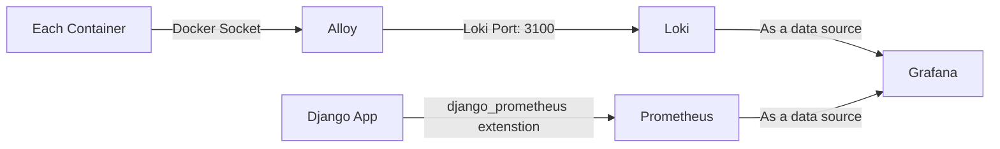

# Monitoring Structure in TelRag Project

The Grafana stack is primarily used in this project, which includes:
- **Grafana** (for dashboarding)
- **Alloy** (for scraping logs)
- **Loki** (for log storage)

For metrics, **Prometheus** is used, while visualization is done through Grafana.

These 4 component, which each of them are being used as a service in docker compose file are the main architecture of TelRag project monitoring system.



## Logs Configuration

In this project, log monitoring is at service-level (container-level), it means that all of the docker containers output logs are being used as the source of log for **alloy** service.

Here is the path for configuring the log:
1. Creating `LOGGING` configuration for django application in the `settings.py`
2. Creating Alloy configuration file, `.config/alloy.hcl` and configuring labels
    - `unix:///var/run/docker.sock` is the global path for the Docker daemon, where the socket file is accessible for reading logs.
    - `__meta_docker_container_name` contains source labels that exist in the Docker socket.
3. `loki.source.docker` is used to properly retrieve Django logs from the Docker socket.
4. `loki.process` is used for parsing Django app JSON output logs into the Loki structure. It also adds custom labels to the logs for easier filtering.
5. `loki.write` is used for storing logs. The Loki service endpoint for writing logs is `http://loki:3100/loki/api/v1/push` (Loki runs on port `3100` by default).
6. Passing `alloy.hcl` as a volume for **alloy** service

### Lables

Log display can be filtered by label. There are three labels in this configuration:

- `service_name` : Displays logs based on the service, with separate logs for each Docker container.
- `level` : Displays logs filtered by their log level, regardless of which container they belong to, such as `INFO`, `DEBUG`, etc.
- `logger` : Displays logs based on the type of logger, such as the Django application logger or the Matplotlib library logger.


## Metrics Configuration (Prometheus)

In the TelRag project, metrics are tracked at the application level and only for this containers:
- `telrag_app`
- `telrag_celery`

The `django_prometheus` Python extenstion is used to handle metrics in the Django application, and it is installed via PyPI.

```shell
pip install django-prometheus
```

Here is the default configuration for `django-prometheus`


1. Adding `'django_prometheus'` in `INSTALLED_APPS` list in `settings.py`

2. Adding `'django_prometheus.middleware.PrometheusBeforeMiddleware'` at the very first of the `MIDDLEWARE` in `settings.py`

3. Adding `'django_prometheus.middleware.PrometheusAfterMiddleware'` at the very last of the `MIDDLEWARE` in `settings.py`

4. Adding `'django_prometheus.urls'` in the `urls.py`

5. Creating `.config/prometheus.yml` file:
    - `scrape_interval`: how often metrics are collected from targets
    - `evaluation_interval`: how often those collected metrics are processed against the rule logic to create new time series or trigger alert states
    - `job_name` : arbitrary name
    - `metrics_path` : the arbitrary path which will be used for prometheus
    - `static_configs` : defining the target for being scraped, which here is just for django app service


    ```yaml
    global:
    scrape_interval: 15s
    evaluation_interval: 15s

    scrape_configs:
    - job_name: "django"
        metrics_path: /metrics
        static_configs:
        - targets: ["app:8000"]
    ```

6. Passing `prometheus.yml` as a volume for **prometheus** service

