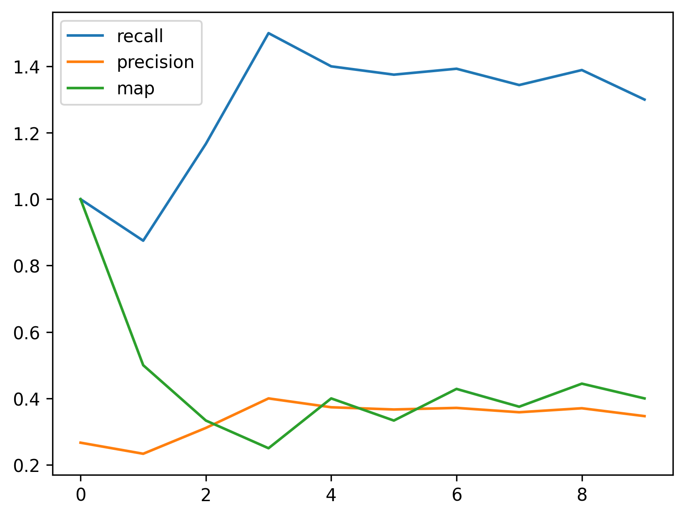
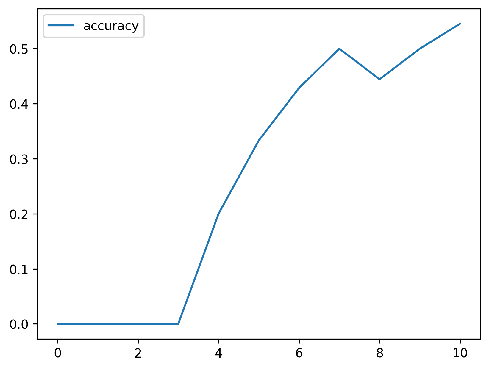

# Telmart RAG System Evaluation

## Retrieval Evaluation

|    |   recall |   precision |      map |
|---:|---------:|------------:|---------:|
|  0 |  1       |    0.266667 | 1        |
|  1 |  0.875   |    0.233333 | 0.5      |
|  2 |  1.16667 |    0.311111 | 0.333333 |
|  3 |  1.5     |    0.4      | 0.25     |
|  4 |  1.4     |    0.373333 | 0.4      |
|  5 |  1.375   |    0.366667 | 0.333333 |
|  6 |  1.39286 |    0.371429 | 0.428571 |
|  7 |  1.34375 |    0.358333 | 0.375    |
|  8 |  1.38889 |    0.37037  | 0.444444 |
|  9 |  1.3     |    0.346667 | 0.4      |

### History

|    |   top_k |   beta |   precision |   recall |   map_at | time                |
|---:|--------:|-------:|------------:|---------:|---------:|:--------------------|
|  0 |      10 |    0   |    0.37     |    0.925 |      0.2 | 2026-06-12 20:42:19 |
|  1 |      10 |    0   |    0.37     |    0.925 |      0.2 | 2026-06-14 17:56:38 |
|  2 |      10 |    0   |    0.37     |    0.925 |      0.2 | 2026-06-14 18:20:49 |
|  3 |       5 |    0.5 |    0.3      |    0.375 |      0.4 | 2026-06-14 18:23:39 |
|  4 |      15 |    0.5 |    0.346667 |    1.3   |      0.4 | 2026-06-14 18:26:34 |

## LLM Evaluation

|    |   accuracy |
|---:|-----------:|
|  0 |   0        |
|  1 |   0        |
|  2 |   0        |
|  3 |   0        |
|  4 |   0.2      |
|  5 |   0.333333 |
|  6 |   0.428571 |
|  7 |   0.5      |
|  8 |   0.444444 |
|  9 |   0.5      |
| 10 |   0.545455 |

### History

|    |   top_k |   beta |   accuracy | time                |
|---:|--------:|-------:|-----------:|:--------------------|
|  0 |      10 |    0   |   0.636364 | 2026-06-12 20:42:51 |
|  1 |      10 |    0   |   0.636364 | 2026-06-14 17:57:07 |
|  2 |       5 |    0.5 |   0.454545 | 2026-06-14 18:24:06 |
|  3 |      15 |    0.5 |   0.545455 | 2026-06-14 18:26:59 |

Thank you for reviewing this report.